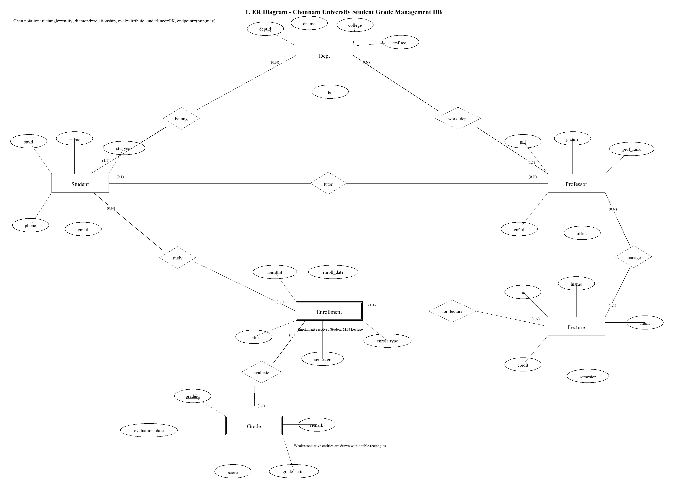
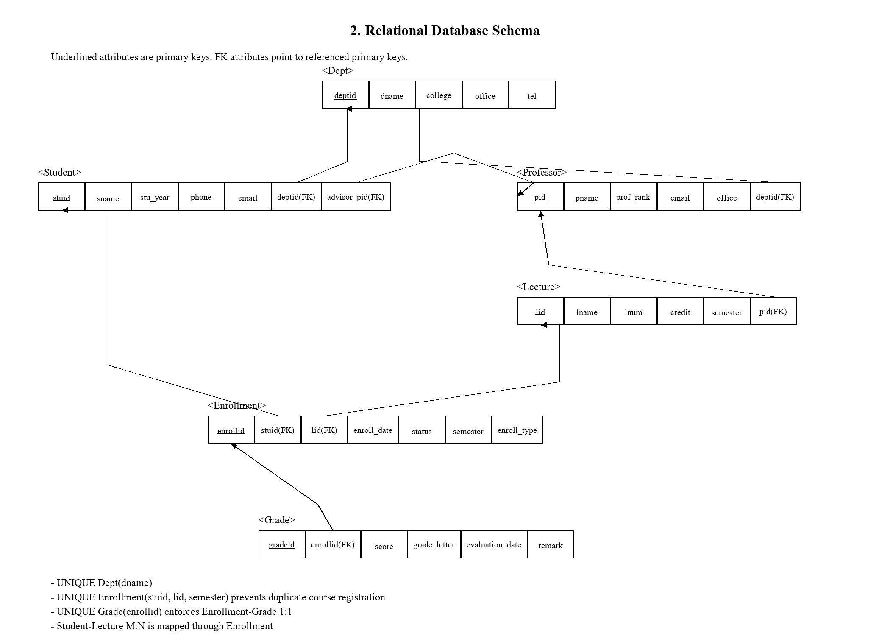
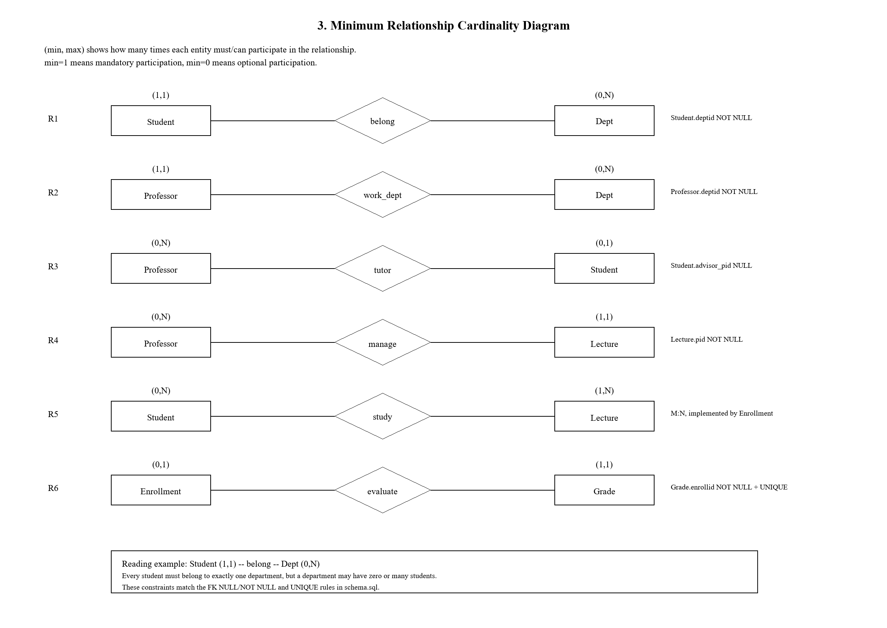

# 02. 스키마정의서

**프로젝트:** 전남대학교 학생 정보·성적관리 데이터베이스  
**작성일:** 2026-06-05  
**DBMS:** MySQL 8.0 / InnoDB / utf8mb4  
**데이터베이스명:** `bokyung`

---

## 1. 문서 목적

본 문서는 요구사항지시서에서 정의한 6개 개체와 6개 관계를 관계형 데이터 모델로 변환한 결과를
정의한다. 또한 공식 공개 학과 데이터 적재, CSV 기반 대용량 더미 데이터 적재, 고급 기능 구현을
위한 추가 SQL 파일의 역할까지 함께 명시한다.

[캡처 삽입 위치: MySQL Workbench `SHOW TABLES;` 결과. 기본 6개 테이블과 View가 보이도록 캡처]

---

## 2. 물리 파일 구성

| 파일 | 역할 |
| --- | --- |
| `sql/schema.sql` | DB 생성, 6개 기본 테이블 생성, 기본 샘플 데이터 INSERT |
| `sql/jnu_public_seed.sql` | 전남대학교 공식 공개 학과 데이터 적재, 공식 데이터 기반 View/Procedure/Transaction/Index |
| `tools/crawl_jnu_public_academic_data.py` | 전남대 공식 대표 홈페이지 공개 대학·학부(과) 페이지에서 학과 데이터 수집 |
| `tools/generate_large_dummy_csv.py` | 개인정보 없는 대용량 CSV 더미 데이터 생성 |
| `sql/load_large_dummy_csv.sql` | CSV 파일을 `LOAD DATA LOCAL INFILE`로 대량 적재 |
| `sql/optimization.sql` | SQL 내부 대용량 데이터 생성 및 인덱스 성능 비교 |

---

## 3. 논리적 모델링

밑줄은 기본키(PK), `FK`는 외래키이다.

교수님 예제의 스키마정의서 형식에 맞춰 별도 그림 파일도 생성하였다.

| 그림 | 파일 | 용도 |
| --- | --- | --- |
| Chen 표기 ER 다이어그램 | `diagrams/chen_er_diagram.png` | 개체, 속성, 관계, 카디널리티와 최소 관계대응수를 사각형·타원·마름모로 표현 |
| 관계 데이터베이스 스키마 | `diagrams/relational_schema_diagram.png` | 릴레이션별 속성, PK 밑줄, FK 참조 화살표 표현 |
| 최소 관계대응도 | `diagrams/minimum_cardinality_diagram.png` | R1~R6 관계의 `(최소, 최대)` 참여 횟수 표현 |

[그림 삽입 위치: `diagrams/chen_er_diagram.png`, `diagrams/relational_schema_diagram.png`, `diagrams/minimum_cardinality_diagram.png`를 교수님 예제처럼 각각 1장씩 삽입]







```text
Dept(deptid, dname, college, office, tel)

Professor(pid, pname, prof_rank, email, office, deptid(FK))
  FK: deptid -> Dept(deptid)

Student(stuid, sname, stu_year, phone, email, deptid(FK), advisor_pid(FK))
  FK: deptid -> Dept(deptid)
  FK: advisor_pid -> Professor(pid)

Lecture(lid, lname, lnum, credit, semester, pid(FK))
  FK: pid -> Professor(pid)

Enrollment(enrollid, stuid(FK), lid(FK), enroll_date, status, semester, enroll_type)
  FK: stuid -> Student(stuid)
  FK: lid -> Lecture(lid)
  UNIQUE(stuid, lid, semester)

Grade(gradeid, enrollid(FK), score, grade_letter, evaluation_date, remark)
  FK: enrollid -> Enrollment(enrollid)
  UNIQUE(enrollid)
```

---

## 4. 관계별 매핑

| 항목 | 관계형 데이터 모델 매핑 | 설명 |
| --- | --- | --- |
| R1 belong | Student(..., deptid(FK), ...), Dept(deptid, ...) | 학생 N:1 학과 관계이므로 N쪽인 Student에 `deptid` 외래키를 삽입하였다. |
| R2 work_dept | Professor(..., deptid(FK)), Dept(deptid, ...) | 교수 N:1 학과 관계이므로 N쪽인 Professor에 `deptid` 외래키를 삽입하였다. |
| R3 tutor | Student(..., advisor_pid(FK)), Professor(pid, ...) | 교수 1:N 학생 관계이므로 N쪽인 Student에 `advisor_pid` 외래키를 삽입하였다. 지도교수 미배정을 허용하기 위해 NULL 가능하다. |
| R4 manage | Lecture(..., pid(FK)), Professor(pid, ...) | 교수 1:N 강의 관계이므로 N쪽인 Lecture에 `pid` 외래키를 삽입하였다. 강의는 반드시 담당 교수가 있어야 하므로 NOT NULL이다. |
| R5 study | Enrollment(enrollid, stuid(FK), lid(FK), ...) | Student-Lecture M:N 관계는 직접 표현할 수 없으므로 Enrollment 교차 릴레이션으로 분해하였다. |
| R6 evaluate | Grade(gradeid, enrollid(FK), ...), Enrollment(enrollid, ...) | Enrollment-Grade 1:1 관계는 Grade에 `enrollid` 외래키와 UNIQUE 제약을 부여하여 구현하였다. |

---

## 5. 테이블 상세 정의

### 5.1 Dept

| 컬럼 | 타입 | 제약 | 설명 |
| --- | --- | --- | --- |
| deptid | INT | PK, AUTO_INCREMENT | 학과번호 |
| dname | VARCHAR(50) | NOT NULL, UNIQUE | 학과명. 공식 공개 학과명 반영 |
| college | VARCHAR(50) | NOT NULL | 단과대학명. 공식 공개 정보 반영 |
| office | VARCHAR(50) | NULL | 학과 사무실. 공식 공개 데이터는 실제 사무실 대신 더미값 사용 |
| tel | VARCHAR(20) | NULL | 학과 전화번호 |

공식 공개 데이터 적재 후 `Dept`에는 전남대학교 공식 대표 홈페이지에서 수집한 114개 학과·학부 정보가
반영된다.

### 5.2 Professor

| 컬럼 | 타입 | 제약 | 설명 |
| --- | --- | --- | --- |
| pid | INT | PK, AUTO_INCREMENT | 교번 |
| pname | VARCHAR(30) | NOT NULL | 교수 이름 |
| prof_rank | VARCHAR(20) | NOT NULL | 직급 |
| email | VARCHAR(100) | UNIQUE | 이메일 |
| office | VARCHAR(50) | NULL | 연구실 |
| deptid | INT | FK, NOT NULL | 소속 학과 |

### 5.3 Student

| 컬럼 | 타입 | 제약 | 설명 |
| --- | --- | --- | --- |
| stuid | INT | PK, AUTO_INCREMENT | 학번 |
| sname | VARCHAR(30) | NOT NULL | 학생 이름 |
| stu_year | TINYINT | NOT NULL, CHECK(1~4) | 학년 |
| phone | VARCHAR(20) | NULL | 연락처 |
| email | VARCHAR(100) | UNIQUE | 이메일 |
| deptid | INT | FK, NOT NULL | 소속 학과 |
| advisor_pid | INT | FK, NULL | 지도교수 |

CSV 대용량 실험에서는 `stuid` 100001~110000 범위에 10,000명의 더미 학생을 적재한다.

### 5.4 Lecture

| 컬럼 | 타입 | 제약 | 설명 |
| --- | --- | --- | --- |
| lid | INT | PK, AUTO_INCREMENT | 강의번호 |
| lname | VARCHAR(60) | NOT NULL | 강의명 |
| lnum | VARCHAR(20) | NOT NULL | 학수번호/분반 |
| credit | TINYINT | NOT NULL, CHECK(1~3) | 학점 |
| semester | VARCHAR(10) | NOT NULL | 개설 학기 |
| pid | INT | FK, NOT NULL | 담당 교수 |

CSV 대용량 실험에서는 `lid` 200001~201000 범위에 1,000개의 더미 강의를 적재한다.

### 5.5 Enrollment

| 컬럼 | 타입 | 제약 | 설명 |
| --- | --- | --- | --- |
| enrollid | INT | PK, AUTO_INCREMENT | 수강신청 ID |
| stuid | INT | FK, NOT NULL | 신청 학생 |
| lid | INT | FK, NOT NULL | 신청 강의 |
| enroll_date | DATE | NOT NULL | 신청일 |
| status | ENUM('수강중','취소','완료') | NOT NULL | 수강 상태 |
| semester | VARCHAR(10) | NOT NULL | 수강 학기 |
| enroll_type | ENUM('정규','재수강') | NOT NULL | 신청 구분 |
| UNIQUE | (stuid,lid,semester) | 중복 방지 | 같은 학기 같은 강의 중복 신청 차단 |

CSV 대용량 실험에서는 `enrollid` 300001~350000 범위에 50,000건의 더미 수강신청을 적재한다.

### 5.6 Grade

| 컬럼 | 타입 | 제약 | 설명 |
| --- | --- | --- | --- |
| gradeid | INT | PK, AUTO_INCREMENT | 성적 ID |
| enrollid | INT | FK, NOT NULL, UNIQUE | 대상 수강신청 |
| score | DECIMAL(5,2) | NOT NULL, CHECK(0~100) | 점수 |
| grade_letter | VARCHAR(2) | NULL | 등급 |
| evaluation_date | DATE | NULL | 평가일 |
| remark | VARCHAR(100) | NULL | 비고 |

CSV 대용량 실험에서는 `gradeid` 400001~450000 범위에 50,000건의 더미 성적을 적재한다.

---

## 6. 외래키 및 삭제 규칙

| FK 이름 | 자식 컬럼 | 부모 컬럼 | ON DELETE | ON UPDATE | 설계 의도 |
| --- | --- | --- | --- | --- | --- |
| fk_prof_dept | Professor.deptid | Dept.deptid | RESTRICT | CASCADE | 교수 소속 학과 무결성 |
| fk_stu_dept | Student.deptid | Dept.deptid | RESTRICT | CASCADE | 학생 소속 학과 무결성 |
| fk_stu_advisor | Student.advisor_pid | Professor.pid | SET NULL | CASCADE | 지도교수 삭제 시 학생은 보존 |
| fk_lec_prof | Lecture.pid | Professor.pid | RESTRICT | CASCADE | 담당 교수 없는 강의 방지 |
| fk_enr_stu | Enrollment.stuid | Student.stuid | CASCADE | CASCADE | 학생 삭제 시 수강신청도 삭제 |
| fk_enr_lec | Enrollment.lid | Lecture.lid | CASCADE | CASCADE | 강의 삭제 시 수강신청도 삭제 |
| fk_grade_enr | Grade.enrollid | Enrollment.enrollid | CASCADE | CASCADE | 수강신청 삭제 시 성적도 삭제 |

---

## 7. 인덱스 설계

| 인덱스 | 대상 | 목적 | 구현 파일 |
| --- | --- | --- | --- |
| PRIMARY | 각 테이블 PK | 기본 조회 및 조인 | schema.sql |
| uq_dept_name | Dept(dname) | 공식 학과명 중복 방지 | schema.sql |
| uq_enroll | Enrollment(stuid,lid,semester) | 중복 수강신청 방지 | schema.sql |
| uq_grade_enroll | Grade(enrollid) | 수강신청-성적 1:1 보장 | schema.sql |
| idx_dept_college | Dept(college) | 공식 학과 데이터의 단과대학별 검색 최적화 | jnu_public_seed.sql |
| idx_student_name | Student(sname) | 학생 이름 검색 최적화 | optimization.sql |
| idx_lecture_name | Lecture(lname) | 강의명 검색 최적화 | optimization.sql |
| idx_csv_student_name | Student(sname) | CSV 대용량 더미 학생 검색 최적화 | load_large_dummy_csv.sql |
| idx_grade_score | Grade(score) | 점수 범위 검색 최적화 | optimization.sql |

---

## 8. 고급 기능 객체

| 객체 | 종류 | 목적 | 기반 데이터 |
| --- | --- | --- | --- |
| StudentGradeView | View | 학생별 수강·성적표 조회 | 임의 학생/수강/성적 |
| LectureStatView | View | 강의별 수강 인원과 평균 점수 조회 | 임의 수강/성적 |
| JnuPublicDeptView | View | 전남대 공식 공개 학과 목록 조회 | 공식 공개 학과 데이터 |
| JnuCollegeDeptStatView | View | 단과대학별 공식 학과 수 집계 | 공식 공개 학과 데이터 |
| GetStudentGrade | Procedure | 특정 학생의 성적 상세와 GPA 조회 | 임의 학생/성적 |
| GetJnuCollegeDepartments | Procedure | 특정 단과대학의 공식 학과 목록과 학과 수 조회 | 공식 공개 학과 데이터 |

---

## 9. 데이터 적재 설계

### 9.1 공식 공개 학과 데이터

`tools/crawl_jnu_public_academic_data.py`가 전남대학교 공식 대표 홈페이지의 대학·학부(과) 공개 페이지를
읽어 학과명, 단과대학명, 전화번호, 출처 URL을 CSV로 저장한다. 생성 결과는
`data/jnu_public_departments.csv`이며, `sql/jnu_public_seed.sql`이 이를 `Dept`에 반영한다.

[캡처 삽입 위치: `SELECT COUNT(*) FROM Dept WHERE office REGEXP '^[0-9]{3}호$';` 결과 114건]

### 9.2 CSV 대용량 더미 데이터

`tools/generate_large_dummy_csv.py`는 다음 CSV를 생성한다.

| CSV | 행 수 | 대상 테이블 |
| --- | --- | --- |
| dummy_students_10000.csv | 10,000 | Student |
| dummy_lectures_1000.csv | 1,000 | Lecture |
| dummy_enrollments_50000.csv | 50,000 | Enrollment |
| dummy_grades_50000.csv | 50,000 | Grade |

`sql/load_large_dummy_csv.sql`은 `LOAD DATA LOCAL INFILE`로 위 CSV를 적재한다. 모든 데이터는 실제
개인정보가 아닌 임의 생성 데이터이다.

[캡처 삽입 위치: CSV 파일 목록과 크기, 또는 CSV 적재 후 테이블별 row count 결과]

---

## 10. ERD 캡처 위치

[캡처 삽입 위치: MySQL Workbench EER Diagram. `Dept`, `Professor`, `Student`, `Lecture`, `Enrollment`, `Grade` 6개 테이블과 `Student-Enrollment-Lecture`, `Enrollment-Grade` 관계가 보이도록 삽입]


